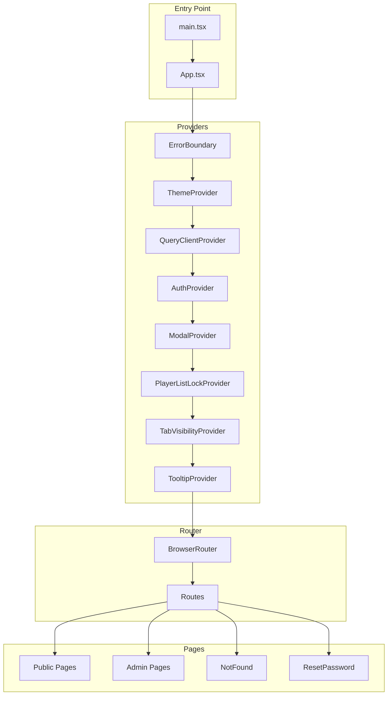
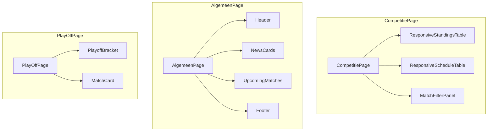
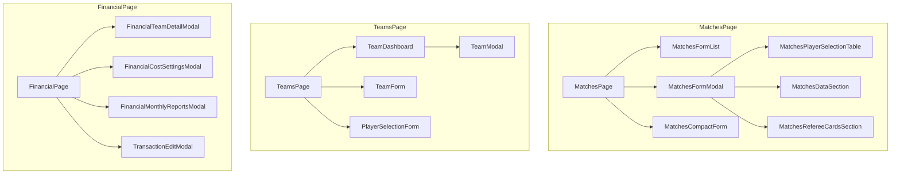
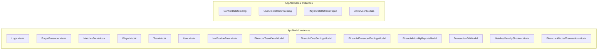
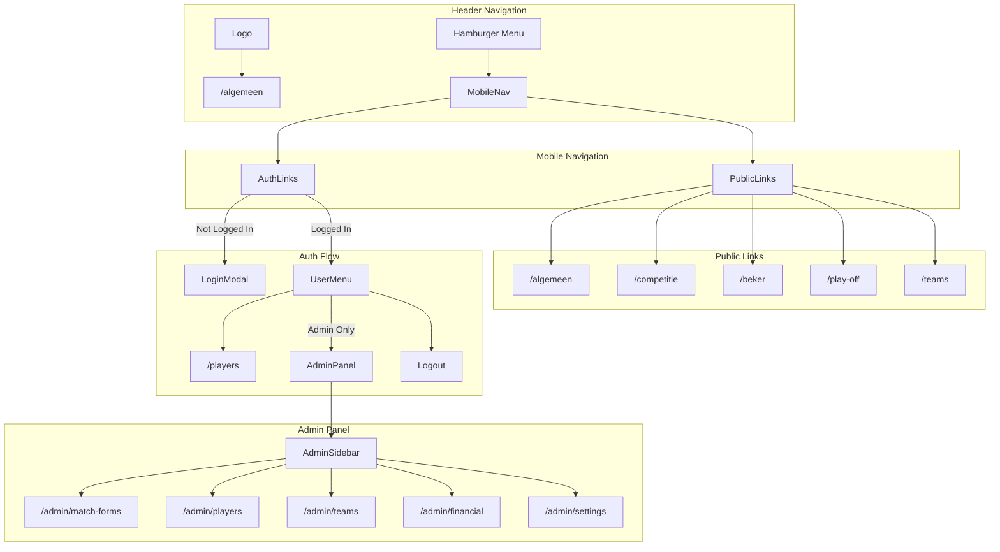
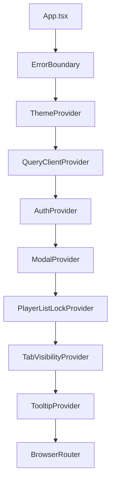
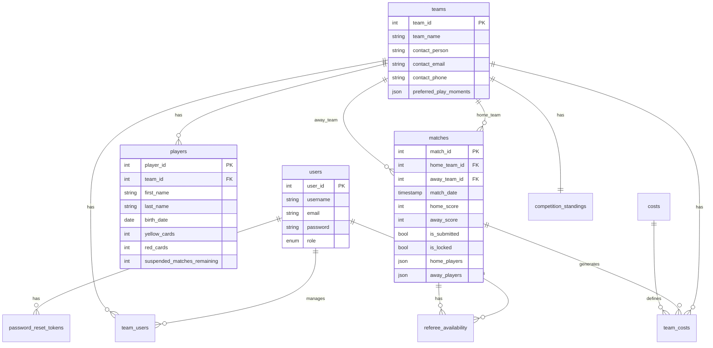
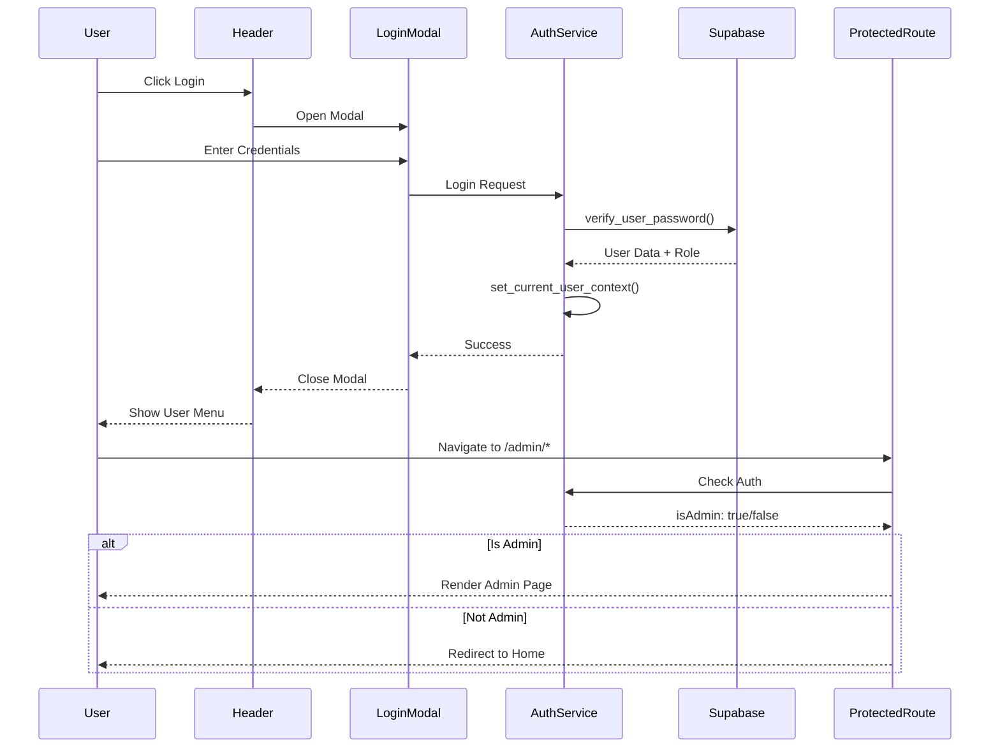

# 🏗️ Architectuur Overzicht - Harelbeekse Minivoetbal

> Laatste update: 24 december 2024

Dit document biedt een volledig overzicht van de architectuur van de Harelbeekse Minivoetbal webapp.

---

## 📊 Statistieken

| Categorie | Aantal |
|-----------|--------|
| Publieke Pagina's | 8 |
| Admin Pagina's | 14 |
| Modals | 18 |
| Context Providers | 5 |
| Shared UI Components | 40+ |
| Edge Functions | 8 |

---

## 🗺️ App Structuur Diagram



---

## 📄 Pagina's Overzicht

### Publieke Pagina's

| Route | Component | Beschrijving |
|-------|-----------|--------------|
| `/algemeen` | `AlgemeenPage` | Algemene informatie & nieuws |
| `/competitie` | `CompetitiePage` | Competitie stand & programma |
| `/beker` | `PublicBekerPage` | Beker competitie overzicht |
| `/play-off` | `PlayOffPage` | Play-off bracket & resultaten |
| `/teams` | `TeamsList` | Lijst van alle teams |
| `/players` | `PlayerPage` | Spelers beheer (team manager) |
| `/kaarten` | `KaartenPage` | Kaarten overzicht |
| `/reglement` | `ReglementPage` | Competitie reglement |

### Admin Pagina's

| Route | Component | Beschrijving |
|-------|-----------|--------------|
| `/admin/match-forms` | `MatchesPage` | Wedstrijdformulieren beheer |
| `/admin/players` | `PlayerPage` | Spelers administratie |
| `/admin/teams` | `TeamsPage` | Teams beheer |
| `/admin/competition` | `CompetitionPage` | Competitie instellingen |
| `/admin/beker` | `BekerPage` | Beker beheer |
| `/admin/play-off` | `AdminPlayoffPage` | Play-off beheer |
| `/admin/financial` | `FinancialPage` | Financieel overzicht |
| `/admin/suspensions` | `AdminSuspensionsPage` | Schorsingen beheer |
| `/admin/scheidsrechters` | `ScheidsrechtersPage` | Scheidsrechters beheer |
| `/admin/notifications` | `NotificationPage` | Notificaties beheer |
| `/admin/blog` | `BlogPage` | Blog/nieuws beheer |
| `/admin/users` | `UserPage` | Gebruikers beheer |
| `/admin/settings` | `SettingsPage` | Systeem instellingen |
| `/admin/schorsingen` | `SchorsingenPage` | Schorsingen regels |

---

## 🧩 Component Hierarchie per Pagina

### Publieke Pagina's



### Admin Pagina's



---

## 🪟 Modal Systeem

### Modal Types

| Type | Base Component | Gebruik |
|------|----------------|---------|
| `AppModal` | `Dialog` | Formulieren, details, selecties |
| `AppAlertModal` | `AlertDialog` | Bevestigingen, waarschuwingen |

### Alle Modals



### Modal Details Tabel

| Modal | Caller Component | Size | Variant |
|-------|------------------|------|---------|
| `LoginModal` | `Header` | `md` | `AppModal` |
| `ForgotPasswordModal` | `LoginModal` | `sm` | `AppModal` |
| `MatchesFormModal` | `MatchesFormList` | `xl` | `AppModal` |
| `PlayerModal` | `PlayerPage` | `md` | `AppModal` |
| `TeamModal` | `TeamsList` | `lg` | `AppModal` |
| `UserModal` | `UserPage` | `md` | `AppModal` |
| `NotificationFormModal` | `NotificationPage` | `lg` | `AppModal` |
| `FinancialTeamDetailModal` | `FinancialPage` | `xl` | `AppModal` |
| `FinancialCostSettingsModal` | `FinancialPage` | `lg` | `AppModal` |
| `FinancialEnhancedSettingsModal` | `FinancialPage` | `xl` | `AppModal` |
| `FinancialMonthlyReportsModal` | `FinancialPage` | `lg` | `AppModal` |
| `TransactionEditModal` | `FinancialTeamDetailModal` | `md` | `AppModal` |
| `MatchesPenaltyShootoutModal` | `MatchesFormModal` | `md` | `AppModal` |
| `FinancialAffectedTransactionsModal` | `FinancialCostSettingsModal` | `lg` | `AppModal` |
| `ConfirmDeleteDialog` | `TeamsList` | `sm` | `AppAlertModal` |
| `UserDeleteConfirmDialog` | `UserPage` | `sm` | `AppAlertModal` |
| `PlayerDataRefreshPopup` | `MatchesFormModal` | `sm` | `AppAlertModal` |

---

## 🧭 Navigatie Flow



---

## 🔄 Context & State Management

### Provider Hierarchie



### Context Details

| Context | Bestand | Hook | Doel |
|---------|---------|------|------|
| `AuthProvider` | `AuthProvider.tsx` | `useAuth` | Authenticatie & user state |
| `ModalProvider` | `ModalContext.tsx` | `useModal` | Centrale modal state |
| `PlayerListLockProvider` | `PlayerListLockContext.tsx` | `usePlayerListLock` | Spelerlijst lock status |
| `TabVisibilityProvider` | `TabVisibilityContext.tsx` | `useTabVisibility` | Tab zichtbaarheid settings |
| `ThemeProvider` | `use-theme.tsx` | `useTheme` | Dark/light mode |

---

## 🎨 Shared UI Components

### Basis Components

| Component | Bestand | Beschrijving |
|-----------|---------|--------------|
| `Button` | `button.tsx` | Knop met varianten |
| `Input` | `input.tsx` | Tekst invoerveld |
| `Select` | `select.tsx` | Dropdown selectie |
| `Checkbox` | `checkbox.tsx` | Checkbox input |
| `Switch` | `switch.tsx` | Toggle switch |
| `Label` | `label.tsx` | Form label |
| `Textarea` | `textarea.tsx` | Multi-line tekst |

### Layout Components

| Component | Bestand | Beschrijving |
|-----------|---------|--------------|
| `Card` | `card.tsx` | Card container |
| `Dialog` | `dialog.tsx` | Modal dialog base |
| `Sheet` | `sheet.tsx` | Slide-in panel |
| `Tabs` | `tabs.tsx` | Tab navigatie |
| `Accordion` | `accordion.tsx` | Inklapbare secties |
| `Separator` | `separator.tsx` | Visuele scheiding |
| `ScrollArea` | `scroll-area.tsx` | Scrollbare container |

### Feedback Components

| Component | Bestand | Beschrijving |
|-----------|---------|--------------|
| `Toast` | `toast.tsx` | Notificatie toast |
| `Sonner` | `sonner.tsx` | Toast provider |
| `Alert` | `alert.tsx` | Alert berichten |
| `Progress` | `progress.tsx` | Voortgangsbalk |
| `Skeleton` | `skeleton.tsx` | Loading placeholder |

### Data Display

| Component | Bestand | Beschrijving |
|-----------|---------|--------------|
| `Table` | `table.tsx` | Data tabel |
| `Badge` | `badge.tsx` | Status badge |
| `Tooltip` | `tooltip.tsx` | Hover tooltip |

### Custom Components

| Component | Bestand | Beschrijving |
|-----------|---------|--------------|
| `AppModal` | `app-modal.tsx` | Standaard modal wrapper |
| `AppAlertModal` | `app-alert-modal.tsx` | Bevestiging modal |
| `LoadingSpinner` | `LoadingSpinner.tsx` | Laad indicator |
| `PageHeader` | `page-header.tsx` | Pagina header |
| `FilterInput` | `filter-input.tsx` | Filter invoer |
| `SearchInput` | `search-input.tsx` | Zoek invoer |

---

## ⚡ Edge Functions

| Functie | Bestand | Beschrijving | Auth |
|---------|---------|--------------|------|
| `send-password-reset` | `send-password-reset/index.ts` | Wachtwoord reset emails | Public |
| `send-welcome-email` | `send-welcome-email/index.ts` | Welkom emails | Public |
| `delete-user` | `delete-user/index.ts` | Gebruiker verwijderen | Protected |
| `generate-competition-schedule` | `generate-competition-schedule/index.ts` | Competitie schema genereren | Protected |
| `generate-monthly-polls` | `generate-monthly-polls/index.ts` | Maandelijkse polls | Protected |
| `sync-card-penalties` | `sync-card-penalties/index.ts` | Kaart boetes sync | Protected |
| `sync-match-costs` | `sync-match-costs/index.ts` | Wedstrijd kosten sync | Protected |
| `update-season-data` | `update-season-data/index.ts` | Seizoen data update | Protected |

---

## 🗄️ Database Tabellen



---

## 📁 Folder Structuur

```
src/
├── components/
│   ├── common/           # Gedeelde componenten
│   ├── layout/           # Layout componenten
│   ├── navigation/       # Navigatie componenten
│   ├── pages/
│   │   ├── admin/        # Admin pagina's
│   │   ├── footer/       # Footer component
│   │   ├── header/       # Header component
│   │   ├── login/        # Login componenten
│   │   └── public/       # Publieke pagina's
│   ├── tables/           # Tabel componenten
│   ├── ui/               # Shadcn UI componenten
│   └── user/             # User management
├── config/               # Route configuratie
├── context/              # React contexts
├── domains/              # Domain-driven modules
├── hooks/                # Custom React hooks
├── integrations/         # Supabase integratie
├── lib/                  # Utility functies
├── pages/                # Route entry points
├── services/             # Business logic services
└── types/                # TypeScript types

supabase/
├── functions/            # Edge functions
│   ├── delete-user/
│   ├── generate-competition-schedule/
│   ├── generate-monthly-polls/
│   ├── send-password-reset/
│   ├── send-welcome-email/
│   ├── sync-card-penalties/
│   ├── sync-match-costs/
│   └── update-season-data/
├── migrations/           # Database migrations
└── config.toml           # Supabase configuratie
```

---

## 🔒 Security & Auth Flow



---

## 📱 Responsive Design

De applicatie is mobile-first ontworpen met de volgende breakpoints:

| Breakpoint | Pixels | Gebruik |
|------------|--------|---------|
| `sm` | 640px | Kleine tablets |
| `md` | 768px | Tablets |
| `lg` | 1024px | Kleine laptops |
| `xl` | 1280px | Desktops |
| `2xl` | 1536px | Grote schermen |

### Mobile Specifieke Componenten

- `HamburgerIcon` - Mobile menu trigger
- `Sheet` - Slide-in navigatie
- `ResponsiveTable` - Scroll/card view switch
- `AdminQuickSheet` - Admin snelmenu

---

## 🎯 Key Patterns

### 1. Modal Pattern
```typescript
// Gebruik via context
const { openModal, closeModal } = useModal();
openModal(<PlayerModal player={player} onClose={closeModal} />);
```

### 2. Protected Route Pattern
```typescript
<ProtectedRoute requireAdmin>
  <AdminPage />
</ProtectedRoute>
```

### 3. Data Fetching Pattern
```typescript
// React Query met Supabase
const { data, isLoading, error } = useQuery({
  queryKey: ['players', teamId],
  queryFn: () => playerService.getByTeam(teamId)
});
```

### 4. Form Pattern
```typescript
// React Hook Form met Zod
const form = useForm<FormSchema>({
  resolver: zodResolver(formSchema),
  defaultValues: { ... }
});
```

---

## 📚 Gerelateerde Documentatie

- [ROUTING.md](./DOCUMENTATIE/ROUTING.md) - Routing strategie
- [MODAL_SYSTEM_GUIDELINES.md](./DOCUMENTATIE/MODAL_SYSTEM_GUIDELINES.md) - Modal richtlijnen
- [DESIGN_TOKENS.md](./DOCUMENTATIE/DESIGN_TOKENS.md) - Design systeem
- [UI_COMPONENTS_AUDIT.md](./DOCUMENTATIE/UI_COMPONENTS_AUDIT.md) - Component audit

---

*Dit document wordt automatisch bijgewerkt bij significante architectuurwijzigingen.*
